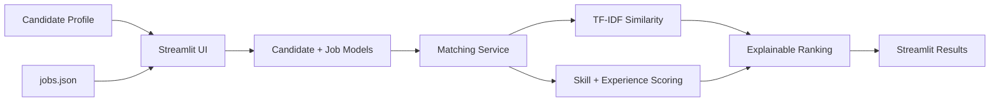

# CareerBridge — Talent Acquisition Analytics

A **Streamlit-first recruitment analytics and candidate-matching application** built with Python. It provides an interactive workspace for candidate profiles, explainable job matching, skill-gap analysis, and ranking.

The repository also retains the original FastAPI and Playwright implementation for backend/reference use.

## 🚀 Streamlit deployment

The Streamlit app entry point is:

```text
streamlit_app.py
```

### Run locally

```bash
python -m venv .venv

# Windows
.venv\Scripts\activate

# macOS/Linux
source .venv/bin/activate

pip install -r requirements.txt
streamlit run streamlit_app.py
```

Open the local URL shown by Streamlit, usually `http://localhost:8501`.

### Deploy on Streamlit Community Cloud

1. Push this repository to GitHub.
2. Open Streamlit Community Cloud and create a new app.
3. Select repository: `ankitha768/careerbridge-talent-acquisition-analytics`.
4. Select branch: `main`.
5. Set the main file to: `streamlit_app.py`.
6. Deploy.

The deployed demo uses the repository's sample job data, so it does not require live job-site scraping or external services.

## Features

- 👤 Candidate profile input.
- 🧠 TF-IDF semantic similarity.
- 🧩 Required-skill overlap analysis.
- 📈 Transparent match scoring.
- 🏆 Job ranking with explanations.
- 🔎 Missing-skill identification.
- 📚 Offline sample dataset for reliable deployment.
- 🐍 Python-only Streamlit deployment path.
- ⚙️ Original FastAPI/Playwright workflow retained for backend reference.

## Screenshots

### Product workspace


### Candidate matching


### Data pipeline


## Matching logic

The deployed Streamlit app uses the same matching service already present in the repository:

- Skill overlap contributes up to 60 points.
- TF-IDF cosine similarity contributes up to 20 points.
- Experience fit contributes up to 20 points.
- A complete required-skill and experience match is capped at 100.

The result also lists matched and missing skills and provides an explanation for each role.

## Streamlit architecture



## Project structure

```text
streamlit_app.py
requirements.txt
requirements-api.txt
.streamlit/config.toml
app/
  models.py
  services/matcher.py
  services/ranking.py
  scraper/
data/
tests/
docs/screenshots/
```

## Legacy API / scraping setup

The original FastAPI implementation can still be run separately:

```bash
pip install -r requirements-api.txt
uvicorn app.main:app --reload
```

The Playwright collector is intentionally generic and should only be used with permitted public sources. Do not bypass authentication, anti-bot controls, robots restrictions, or access controls.

## Notes

- Streamlit deployment uses sample data from `data/jobs.json`, making the demo deterministic and self-contained.
- No live scraping is required for the deployed portfolio demo.
- The repository's visual assets are documentation mockups, not screenshots of a live deployed instance.
