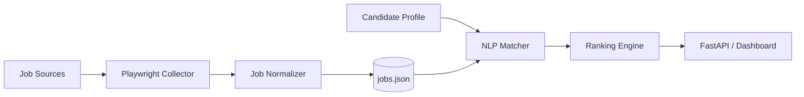
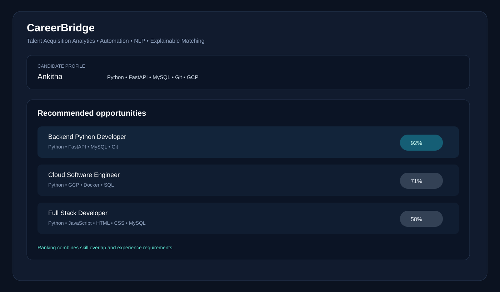
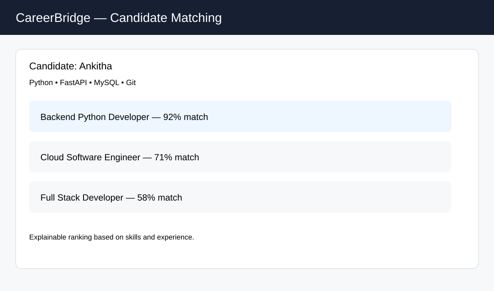
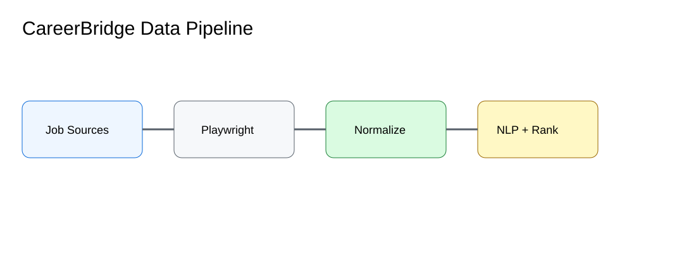

# CareerBridge — Talent Acquisition Analytics

A recruitment analytics and candidate-matching prototype using **Playwright**, lightweight **NLP**, and a transparent ranking engine.

## Features
- Playwright-based job collection workflow.
- Normalized job records.
- Candidate profile parsing from skills and experience.
- Skill-overlap and experience matching.
- Explainable candidate ranking.
- Sample dataset for offline demos.
- FastAPI endpoints for matching and job collection.
- Responsible scraping controls: explicit target URL, delay, and local/sample mode.

## Architecture


## Screenshots

### Product workspace


### Candidate matching


### Data pipeline


## Quick start
```bash
python -m venv .venv
# Windows
.venv\Scripts\activate
# macOS/Linux
source .venv/bin/activate
pip install -r requirements.txt
uvicorn app.main:app --reload
```
Open http://127.0.0.1:8000/docs

## Match example
```json
POST /api/v1/match
{
  "candidate": {
    "name": "Ankitha",
    "skills": ["Python", "FastAPI", "MySQL", "Git"],
    "years_experience": 1
  },
  "job_id": "job-001"
}
```

## Scraper
The collector is intentionally generic. Set a public target URL and CSS selectors in code/config for a permitted source. Do not bypass authentication, anti-bot controls, robots restrictions, or access controls.

## Project structure
```text
app/
  api/routes.py
  models.py
  services/matcher.py
  services/ranking.py
  scraper/playwright_collector.py
data/jobs.json
tests/
docs/screenshots/
requirements.txt
.env.example
```

This is a portfolio implementation of the CareerBridge project scope; sample data is included so the application works without live scraping.

## Production-style support files
- `Dockerfile` with Chromium installation for Playwright.
- `Makefile` and `.github/workflows/ci.yml` for repeatable setup and CI.
- `data/sample_candidate.json` for an offline demo.
- `docs/API.md` and `docs/scraping.md` for API and responsible collection guidance.
- `docs/screenshots/product-overview.svg` for the polished matching workspace preview.

The visual assets are repository documentation mockups; sample job data is provided for local evaluation.
